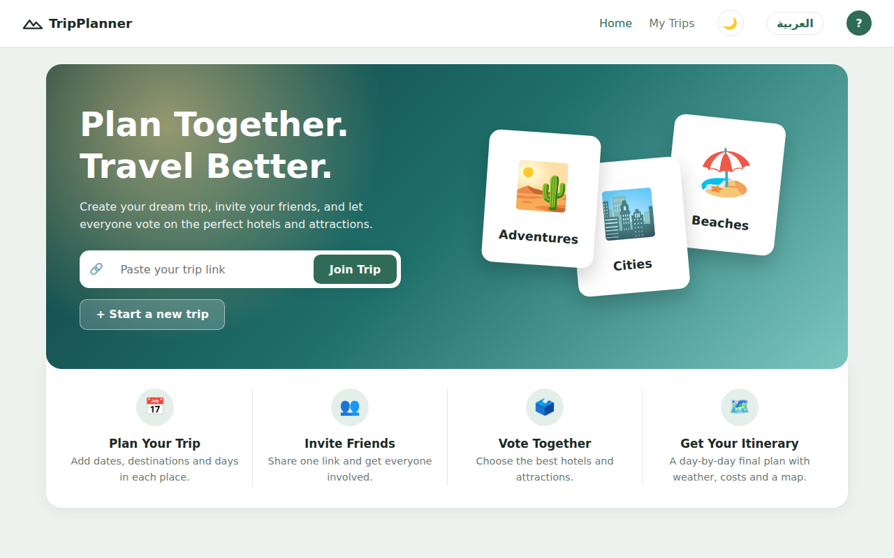
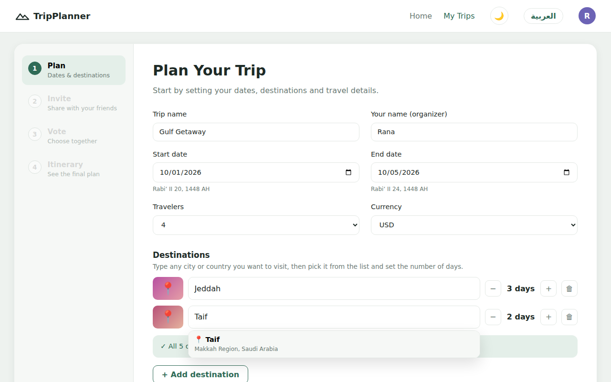
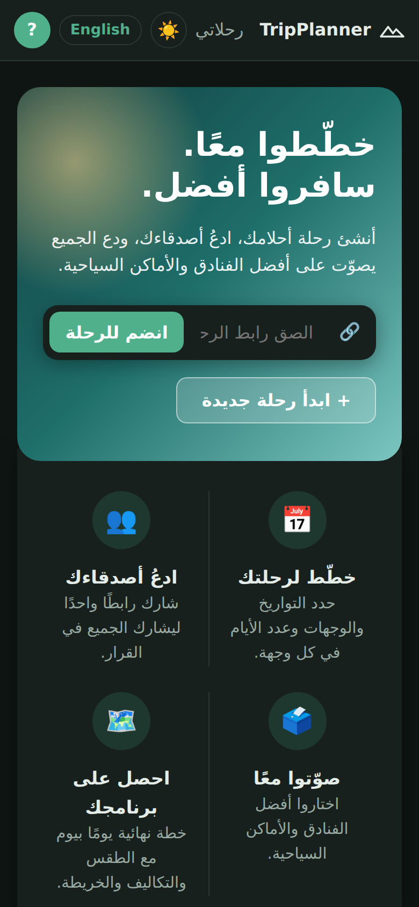

# ✈️ TripPlanner — Plan Together, Travel Better

A group trip planner: create a trip, send one link to your friends, and everyone votes on hotels and attractions. The site then builds a day-by-day itinerary with weather, a route map, costs and a shared-expenses calculator.

**🔗 Live site:** `https://YOUR-USERNAME.github.io/YOUR-REPO/` *(replace with your link)*

| Home | Plan | Mobile (Arabic, dark mode) |
|---|---|---|
|  |  |  |

---

## Features

- **Any destination**: type any city or country, with live search suggestions.
- **Automatic day planning**: the trip dates set the total days, which are split evenly between destinations, with a warning if the days don't add up.
- **Invite with one link**: friends open it, type their name and join. They show up for everyone instantly.
- **Real hotels & attractions** from OpenStreetMap, with **photos** from Wikimedia Commons. Members can suggest their own too.
- **Voting**: one hotel for the whole stay, or two hotels with the nights split. Votes update live.
- **Voting deadline** with a countdown. After it passes, voting locks for members.
- **Comments** on each hotel so the group can discuss.
- **Maps**: all hotels and places on a map, plus a coloured route for each day.
- **Final itinerary**: morning and evening plans, the hotel for each night, **weather** (a forecast, or last year's weather for trips further away) and **Hijri dates**.
- **Costs**: estimated budget per person (editable by the organizer).
- **Shared expenses**: record who paid what, and see who owes whom.
- **Export**: add the trip to your phone's calendar (.ics), share the plan on WhatsApp, or save it as a PDF.
- **English / العربية**, **dark mode**, works on phones, and can be **installed as an app** (PWA).

## Built with

- Plain **HTML, CSS and JavaScript** (no framework)
- **Firebase Realtime Database** (REST API + live streaming) for sharing between members
- **OpenStreetMap / Nominatim** for places · **Wikidata** for photos · **Open-Meteo** for weather · **Leaflet** for maps

## Project structure

```
index.html              the page
style.css               all styles (light + dark mode)
js/config.js            ← your Firebase link goes here
js/i18n.js              all texts in English and Arabic
js/core.js              state, helpers, saving, language & theme
js/sync.js              Firebase: saving, live updates, invite links
js/places.js            destination search, hotels, attractions, photos
js/extras.js            weather, maps, calendar file, sharing, install
js/plan.js              step 1 – plan the trip
js/invite.js            step 2 – invite members, deadline, joining
js/vote.js              step 3 – voting, comments
js/itinerary.js         step 4 – final plan, costs, shared expenses
js/app.js               navigation and startup
sw.js, manifest.webmanifest, icons/   offline support + install as an app
firebase-rules.json     database security rules
```

## Setup

1. **Firebase:** create a project at [console.firebase.google.com](https://console.firebase.google.com), then go to **Build → Realtime Database → Create Database**.
2. Paste the database link into `js/config.js`.
3. In the database's **Rules** tab, paste the contents of `firebase-rules.json` and click **Publish**.
4. **GitHub Pages:** Settings → Pages → Branch `main` / `(root)` → Save.

Without a Firebase link, the site still works, but each person only sees what is saved on their own device.

## Notes & limits

- Hotel prices and ratings aren't available from OpenStreetMap, so members can add a price when they suggest a hotel.
- The free place-search service allows about one request per second, which is fine for small groups.
- The security rules block deleting trips and reject invalid data. Without a login system, though, anyone with a trip link can change that trip's data.

---
Made by **Rana Jaber** · University of Jeddah
